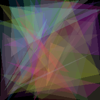
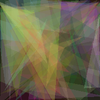
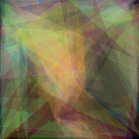

# Genetic Algorithm Drawer
A Python program to reproduce images as a collection of overlapping translucent triangles using Genetic Algorithm.  
I didn't come up with this idea. This is a reimplementation of Roger Johansson's [Evolution of Mona Lisa](https://rogerjohansson.blog/2008/12/07/genetic-programming-evolution-of-mona-lisa/).

# Usage
This program is tested on Python 2.7.10.  
Run with command "Python gadrawer.py [image_file_name]".  
The output images will be saved at folder outputs/ every 100 iterations.

# Demo
See how this approximation to Mona Lisa evolves through generations:  
 

